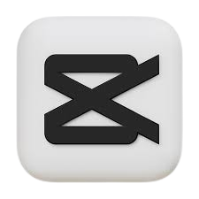

# CapCut Clone

<p align="center">
  
</p>

<p align="center">
  <strong>Éditeur vidéo mobile pour Android, construit avec React Native CLI.</strong>
</p>

<p align="center">
  Splash · Onboarding · Auth · Home · Projets · Editor (Trim, Split, Speed, Filters, Adjust, Text, Audio, Voiceover, Transitions, Overlays, Stickers, Keyframes) · Export Cloudinary
</p>

---

## ⚙️ Stack technique

| Domaine | Lib |
|---|---|
| Core | React Native 0.85 (CLI, pas Expo), TypeScript strict |
| Navigation | React Navigation v6 (Stack + Bottom Tabs + Modals) |
| Vidéo | `ffmpeg-kit-react-native` (full-gpl), `react-native-video`, `react-native-vision-camera`, `react-native-image-picker` |
| Animations | `react-native-reanimated` v3, `react-native-gesture-handler` v2, `@gorhom/bottom-sheet` v4 |
| Audio | `react-native-audio-recorder-player`, `react-native-track-player` |
| State | `zustand` (local), `@tanstack/react-query` (server) |
| Backend | Supabase (PostgreSQL + Auth + Realtime), Cloudinary (vidéo/thumbnails) |
| UI | `react-native-linear-gradient`, `react-native-svg`, `react-native-vector-icons` (MaterialIcons) |
| Stockage | `@react-native-async-storage/async-storage`, `react-native-mmkv`, `react-native-fs` |

---

## 📂 Arborescence

```
captcut/
├── android/                      # Projet Android natif
├── ios/                          # Projet iOS (non couvert)
├── design/                       # Maquettes HTML de référence (26 écrans)
├── src/
│   ├── app/                      # App.tsx + Providers (Query, Auth, Theme)
│   ├── navigation/               # RootNavigator + AuthNavigator + MainNavigator + EditorNavigator
│   ├── screens/                  # 26 écrans (splash, onboarding, auth, home, projects, profile, settings, notifications, mediaPicker, editor)
│   ├── components/
│   │   ├── ui/                   # Button, IconButton, BottomSheet, TabBar, Slider, Toggle, Avatar, Badge, Card, LoadingOverlay, Toast, EmptyState
│   │   ├── editor/               # VideoPreview, Timeline, TimelineCursor, ClipItem, TrimHandle, AudioWaveform, ToolBar, ToolButton, KeyframeMarker
│   │   ├── media/                # VideoCard, VideoThumbnail, MediaGrid
│   │   └── effects/              # FilterPreview, TextOverlay, StickerOverlay
│   ├── hooks/                    # useAuth, useEditor, useFFmpeg, useTimeline, useTrimmer, useAudio, useExport, useProjects, usePermissions, useCloudinary, useKeyframe
│   ├── store/                    # editorStore (undo/redo), authStore, projectStore, uiStore
│   ├── services/
│   │   ├── supabase/             # client + auth.service + users.service + projects.service + storage.service
│   │   ├── cloudinary/           # client + upload (XHR progress) + transform URL builder
│   │   └── ffmpeg/               # ffmpeg.service + commands (trim/split/concat/speed/filters/transitions/text/export) + filters
│   ├── types/                    # editor / project / user / media / navigation types
│   ├── constants/                # colors, typography, dimensions, filters (10), transitions (11), permissions
│   ├── utils/                    # formatTime, formatFileSize, debounce, validateMedia, generateThumbnail, uuid
│   └── assets/images/            # logo.png
├── supabase/migrations/          # Schéma SQL (7 tables + RLS + trigger)
├── .env / .env.example
└── package.json
```

---

## 🚀 Démarrage rapide

### 1. Prérequis
- Node ≥ 22.11
- JDK 17
- Android Studio + SDK (API 33+) + un téléphone Android branché en USB (mode développeur + débogage USB)

### 2. Installer les dépendances
React 19 + RN 0.85 étant très récents, plusieurs libs déclarent encore React 18 dans leurs `peerDependencies`. On force npm à passer outre :

```bash
npm install --legacy-peer-deps
```

### 3. Configurer FFmpegKit (déjà fait)
Le fichier `android/app/build.gradle` contient déjà :

```gradle
ext {
    ffmpegKitPackage = "full-gpl"
}
```

Cette variante embarque **tous** les filtres (drawtext, curves, xfade, eq, unsharp, vignette…). Le build sera environ ~200 MB plus lourd, c'est normal.

### 4. Configurer les variables d'environnement
Édite `.env` (créé à partir de `.env.example`) :

```env
SUPABASE_URL=https://xxxxxxxx.supabase.co
SUPABASE_ANON_KEY=eyJhbGciOiJIUzI1...
CLOUDINARY_CLOUD_NAME=ton_cloud
CLOUDINARY_API_KEY=...
CLOUDINARY_API_SECRET=...
CLOUDINARY_UPLOAD_PRESET=capcut_clone_unsigned
```

> ⚠️ Si tu modifies `.env`, relance Metro avec `npm start --reset-cache`.

### 5. Migration Supabase
1. Crée un projet sur https://supabase.com
2. **SQL Editor → New query**
3. Colle le contenu de `supabase/migrations/20260530000001_initial_schema.sql`
4. **Run** → 7 tables + RLS + trigger créés
5. **Authentication → Providers** : active **Email** (décoche "Confirm email" pour tester sans validation)
6. **Project Settings → API** : copie `URL` et `anon public` dans `.env`

### 6. Configurer Cloudinary
1. https://cloudinary.com → **Settings → Upload**
2. **Add upload preset**, nom : `capcut_clone_unsigned`, mode : **Unsigned**, Save
3. **Settings → Account** : copie Cloud name, API key, API secret dans `.env`

### 7. Lancer
**Terminal 1** :
```bash
npm start
```

**Terminal 2** :
```bash
npm run android
```

Premier build : 5–15 min (téléchargement FFmpegKit). Builds suivants : ~30 s.

---

## 🎬 Ce qui est implémenté

### Auth
- Splash animé (logo Reanimated)
- Onboarding 3 slides
- SignIn / SignUp (email + password) via Supabase
- Auto-création du profil au signup (trigger Postgres)
- Persistance de session via AsyncStorage

### Home / Projects
- Hero banner gradient, projets récents, templates
- Liste/grille avec toggle, suppression avec confirmation
- Pull-to-refresh
- Media picker Android (vidéos + photos) avec FFprobe pour la durée

### Editor (le cœur)
- Preview vidéo `react-native-video` synchronisée avec timeline
- Timeline horizontal scrollable, pinch-zoom 0.5x–10x, curseur fixe au centre
- Sélection de clip par tap
- Toolbar horizontal scrollable (13 outils)
- Undo/redo 50 niveaux
- Auto-save toutes les 30 s

### Outils d'édition
| Outil | Implémentation |
|---|---|
| **Trim** | Sliders start/end + bande de miniatures FFmpeg |
| **Split** | Slider position + preview des deux parties |
| **Speed** | 0.1x–10x avec `setpts` + `atempo` chaîné (preset chips + slider) |
| **Text** | Contenu, couleur, taille, ombre, animations (entrance/loop/exit) |
| **Audio** | Bibliothèque de presets + tracks existantes |
| **Voiceover** | Enregistrement micro avec compteur + animation pulse |
| **Filters** | 10 filtres FFmpeg (Cinematic, Vintage, Neon, Portrait, Landscape, Warm, Cold, B&W, Dramatic) + slider intensité |
| **Adjust** | 8 sliders (brightness, contrast, saturation, temperature, shadows, highlights, sharpness, vibrance) → `eq` + `curves` + `unsharp` |
| **Transitions** | 11 transitions xfade (fade, dissolve, wipe, slide, zoom, pixelize, radial…) + slider durée |
| **Overlay** | Picture-in-picture depuis la galerie |
| **Stickers** | Grille 12 stickers MaterialIcons |
| **Keyframe** | Ajout au playhead, interpolation linear/ease-in/ease-out/bezier |
| **Format** | 6 ratios (9:16, 16:9, 1:1, 4:5, 3:4, 4:3) |

### Export
1. **ExportSettings** : résolution (480p–4K), framerate (24/30/60), format MP4
2. **ExportProgress** : ring SVG circulaire + pourcentage + ETA, bouton Cancel (interrompt FFmpegKit)
3. Pipeline : process clip (trim → speed → filter → adjust → volume) → merge → text overlays → audio → encode final
4. Upload Cloudinary avec progress XHR
5. Mise à jour Supabase (`status = completed`, `video_url`, `cloudinary_public_id`)
6. **ExportComplete** : partage natif via `react-native-share`

### Profile / Settings / Notifications
- Stats utilisateur (projets, durée totale, stockage Cloudinary)
- Grille des projets
- Toggles préférences, clear cache, sign out
- Notifications avec mark all read, badge unread

---

## 🗃️ Schéma Supabase

7 tables avec Row Level Security (un user ne voit que ses propres données) :

```
profiles            (id, username, display_name, avatar_url, bio, cloudinary_folder, storage_used/limit)
projects            (id, user_id, title, thumbnail_url, video_url, duration, resolution, status, timeline_data JSONB)
clips               (id, project_id, cloudinary_public_id, start/end_time, position, speed, volume, transform_data, filter_data, keyframes)
text_overlays       (id, project_id, content, font_size/color, position, start/end_time, animations)
audio_tracks        (id, project_id, url, duration, start_time, volume, track_type, fade_in/out)
sticker_overlays    (id, project_id, sticker_id, position, scale, rotation, start/end_time)
notifications       (id, user_id, type, title, body, is_read)
```

Trigger automatique : à chaque `auth.users` créé, une ligne `profiles` est insérée avec un `cloudinary_folder` unique.

---

## 🎨 Design system

| Token | Valeur |
|---|---|
| Background primary | `#000000` (OLED-ready, zero light leak) |
| Background card | `#1a1a1a` |
| Background toolbar | `#111111` |
| Accent primary | `#ff4081` (pink) |
| Accent gradient | `#ff4081 → #9c27b0` |
| Texte primary | `#ffffff` |
| Texte secondary | `#888888` |
| Trim handle | `#FFD700` (yellow) |
| Waveform audio | `#00e676` (vert) |
| Music track | `#ff4081` |
| Cursor timeline | `#ffffff` |
| Radius button | 8 px |
| Radius card | 16 px |
| Spacing grid | 4 px base, 16 px container |

Typo : Hanken Grotesk (headlines, fallback System), Geist (body & timecodes, fallback System / monospace).

---

## 🐛 Dépannage

| Problème | Solution |
|---|---|
| `npm install` échoue (ERESOLVE) | `npm install --legacy-peer-deps` |
| "SDK location not found" | Crée `android/local.properties` avec `sdk.dir=C:\\Users\\<toi>\\AppData\\Local\\Android\\Sdk` |
| "Unable to load script" | Lance `npm start` dans un terminal **avant** `npm run android` |
| `.env` non lu par l'app | Relance Metro avec `npm start --reset-cache` |
| App crash au lancement | `adb logcat *:E` pour voir l'erreur native |
| FFmpegKit "command not found at runtime" | Vérifie `ext { ffmpegKitPackage = "full-gpl" }` dans `android/app/build.gradle` |
| Build trop lourd / lent | Passe à `https-gpl` dans `ffmpegKitPackage` si tu n'as pas besoin de tous les codecs |

---

## 🛠️ Scripts npm

```bash
npm start              # Lance Metro
npm run android        # Build + install + lance sur le device branché
npm run lint           # ESLint
npm run tsc            # Type-check sans émettre
npm test               # Tests Jest
```

---

## 📝 Limitations connues

- **Animations text/sticker** : visibles dans le preview React, mais pas encore brûlées dans la sortie FFmpeg
- **Curve speed** : UI présente, courbe bezier pas encore convertie en commandes FFmpeg
- **Drag-to-reorder timeline** : sélection OK, mais drag pour réordonner pas câblé
- **Google OAuth** : bouton là, lib Google Sign-In à brancher
- **iOS** : non couvert (focus Android only)

---

## 📜 Licence

Projet éducatif (cours ICT202). Non destiné à un usage commercial.
